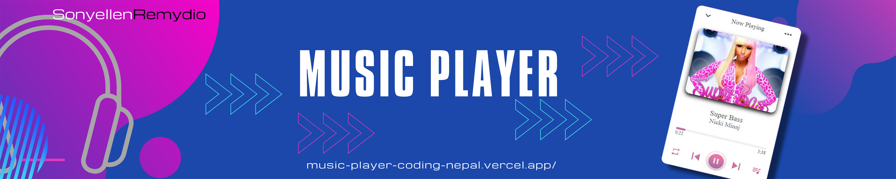
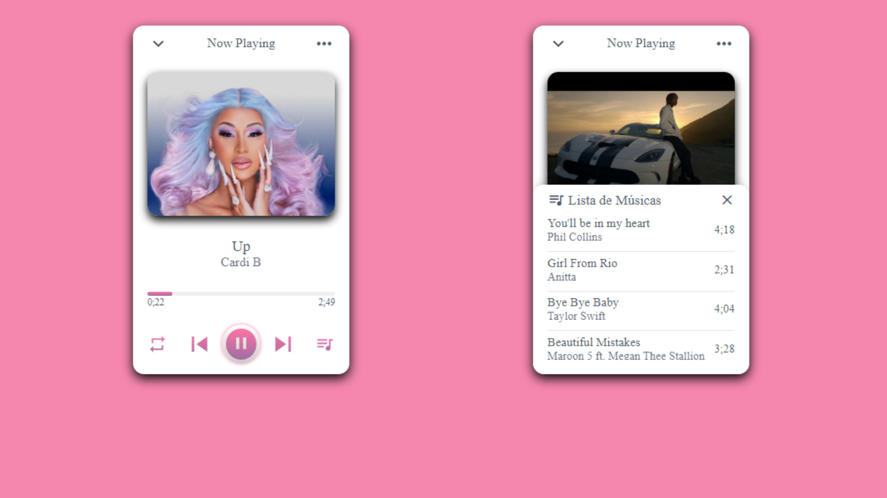

 

## Descrição do Projeto: :computer:

 Este reprodutor de música possui vários recursos, como: você pode repetir a lista inteira, repetir a música apenas ou embaralhar a lista de forma aleatória, reproduzir / pausar uma música, adiantar, pular para a apróxima, ou voltar para a anterior. Você pode ver sua lista de músicas, saber qual música está tocando no momento e também pode selecionar a música da lista para reproduzir. 

 

<h4 align="center"> 
	> Status do Projeto: Em desenvolvimento :warning:
</h4>

 
  
 

 

### Tarefas concluídas:  

- [X] Função play/pause
- [X] Função próxima / anterior
- [X] Função adiantar música
- [X] Função ordem aleatória
- [X] Função repetir música
- [X] Função repetir lista
- [X] Função abrir lista
- [ ] Função escolher música da lista

 

## Deploy da Aplicação com Versel: :star:
> https://music-player-coding-nepal.vercel.app/

 

## Linguagens utilizadas :books:

- [HTML](https://devdocs.io/html/)
- [CSS](https://devdocs.io/css/)
- [JavaScript](https://devdocs.io/javascript/)

 

## 📄 Licença

Esse projeto está sob a licença MIT. Veja o arquivo [LICENSE](LICENSE.md) para mais detalhes.

 

Feito com acompanhamento de *** ♥
